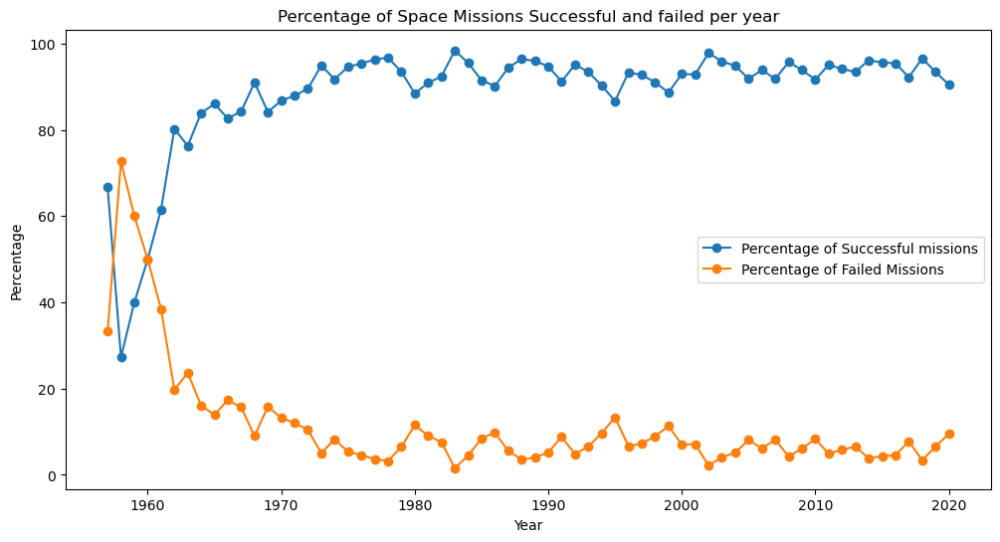

## :rocket: :rocket: :rocket: `SPACE MISSION LAUNCHES` :rocket: :rocket: :rocket:

### Exploratory Data Analysis

#### Introduction
In this project, I'm going to explore a dataset with information from varios space mission launches between  


#### Table of contents 

<ol>
    <li><a href="#Objectives">Objectives</a></li>
    <li>
        <a href="#Setup">Setup</a>
    </li>
    <li>
        <a href="#Download-dataset">Download dataset from Kaggle</a>
        <ol>
            <li><a href="#download-the-mission-launches-data-set">Download the mission launches data set</a></li>
        </ol>
    <li><a href="#Initial-analysis">Preparation</a></li>
    <li>
        <a href="#Eda">EDA: exploratory data analysis</a>
        <ol>
            <li><a href="#Who-launched-most-mission">Who launched the most missions in any given year?</a></li>
            <li>
                <a href="#How-has-the-cost-space-mission-varied-over-time?">How has the cost of a space mission varied over time?</a>
            </li>
             <li><a href="#Which-months-are-the-most-popular-for-launches?">Which months are the most popular for launches?</a></li>
             <li><a href="#Have-space-missions-gotten-safer-or-has-the-chance-of-failure remained-unchanged?">Have space missions gotten safer or has the chance of failure remained unchanged?</a></li>
        </ol>
    </li>
    <li> <a href="#Conclusions"> Conclusions</a></li>
</ol>

<hr style="border:0.5px solid gray">

#### 1. Objectives :dart: :dart:

The main objective is can answer the following questions: 
1. Who launched the most missions in any given year?
2. How has the cost of a space mission varied over time?
3. Which months are the most popular for launches?
4. Have space missions gotten safer or has the chance of failure remained unchanged?

#### 2. Setup :books:

I use the following libraries:

- [Kaggle](https://www.kaggle.com/docs/api) for download the dataset from Kaggle
- zipfile for unzip the dataset
- [Pandas](https://pandas.pydata.org/docs/getting_started/install.html) for managing the data
- [Seaborn](https://seaborn.pydata.org/installing.html) for visualizing data
- [Matplotlib](https://matplotlib.org/stable/install/index.html) for additional plotting tools
- [NumPy](https://numpy.org/install/) for mathematical operations
- SQLAlchemy
- Pandasql

I. Install libraries
```
!pip install kaggle
!pip install zipfile
!pip install pandas
!pip install seaborn
!pip install matplotlib
!pip install numpy
!pip instal sqlalchemy
!pip install pandasql
```


#### 3. Download data set :floppy_disk:

I. In order to download the mission data set i going to use the Kaggle's API. You can download it from [this link](https://www.kaggle.com/datasets/sefercanapaydn/mission-launches).
```
!kaggle datasets download -d sefercanapaydn/mission-launches
```
II. Unzip dataset
```
zipfile_name = 'mission-launches.zip'
with zipfile.ZipFile(zipfile_name, 'r') as file:
    file.extractall()
```
The unzip file is named _mission_launches.csv_

III. Load data into a dataframe
```
mission = pd.read_csv('mission_launches.csv')
display(mission.head())
print("Rows x Columns: ", mission.shape)
```

#### 4. Preparation  :bathtub: :running_woman:
- Analysis of the data types of each column and transformation to the appropriate type.
- Count columns with null values 
- Drop columns with unuseful values
- Statistics on numerical columns and string columns
- Count duplicated values and unique values
- Create a new column: _Year_

#### 5. EDA: exploratory data analysis :female_detective: :chart_with_upwards_trend:

1. Who launched the most missions in any given year?

|Year| Organization | Launches|
|----|--------------|:--------:|
|1976|RVSN USSR|93|
|1977|RVSN USSR|92|
|1971|RVSN USSR|90|


2. How has the cost of a space mission varied over time?


3. Which months are the most popular for launches?


4. Have space missions gotten safer or has the chance of failure remained unchanged?



#### 6. Conclusion

> _See attached document: **Conclusions_space_missions**_

